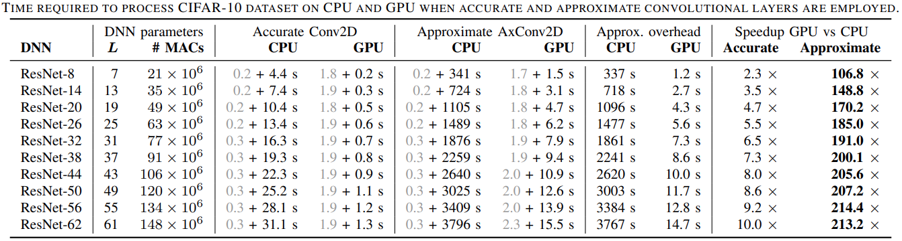

# TensorFlow Approximate Layers

## Overview
This library extends TensorFlow library by appoximate convolutional layers. The approximation is introduced by employing arbitrary approximate multuiplier (e.g. from the EvoApproxLib library of approximate components).

## CPU version
This repository provides two versions of the approximate layers. The first is based on a simple CPU implementation from the TensorFlow library and is located in [cpu](CPU) folder. In this version, a **AxConv2D** layer is implemented, that extends **QuantizedConv2D** layer with approximate multiplier. The application examples are given in the [cpu/README.md](README) file.

For more details see paper: [10.1109/ICCAD45719.2019.8942068](https://dx.doi.org/10.1109/ICCAD45719.2019.8942068) or [arXiv:1907.07229](https://arxiv.org/abs/1907.07229) . If you use this library in your work, please use a following reference

    V. Mrazek, Z. Vasicek, L. Sekanina, M. A. Hanif and M. Shafique, "ALWANN: Automatic Layer-Wise Approximation of Deep Neural Network Accelerators without Retraining," 2019 IEEE/ACM International Conference on Computer-Aided Design (ICCAD), Westminster, CO, USA, 2019, pp. 1-8.

```bibtex
@INPROCEEDINGS{8942068,
    author={V. {Mrazek} and Z. {Vasicek} and L. {Sekanina} and M. A. {Hanif} and M. {Shafique}},
    booktitle={2019 IEEE/ACM International Conference on Computer-Aided Design (ICCAD)},
    title={ALWANN: Automatic Layer-Wise Approximation of Deep Neural Network Accelerators without Retraining},
    year={2019},
    volume={},
    number={},
    pages={1-8},
    keywords={approximate computing;deep neural networks;computational path;ResNet;CIFAR-10},
    doi={10.1109/ICCAD45719.2019.8942068},
    ISSN={1933-7760},
    month={Nov},
}
```

## GPU version
Since the CPU version uses a basic implementation of the convolution, it is not very effective. However, this version was reimplemented in order to achieve a performance of the inference more comparable to the accurate implementation (200x speedup w.r.t. CPU version). The source codes and application examples are given in the [gpu/README.md](README) file.


    F. Vaverka, V. Mrazek, Z. Vasicek and L. Sekanina. "TFApprox: Towards a Fast Emulation of DNN Approximate Hardware Accelerators on GPU". 2020 Design, Automation and Test in Europe Conference (DATE), Grenoble, FR, 2020.


## Speed comparison
