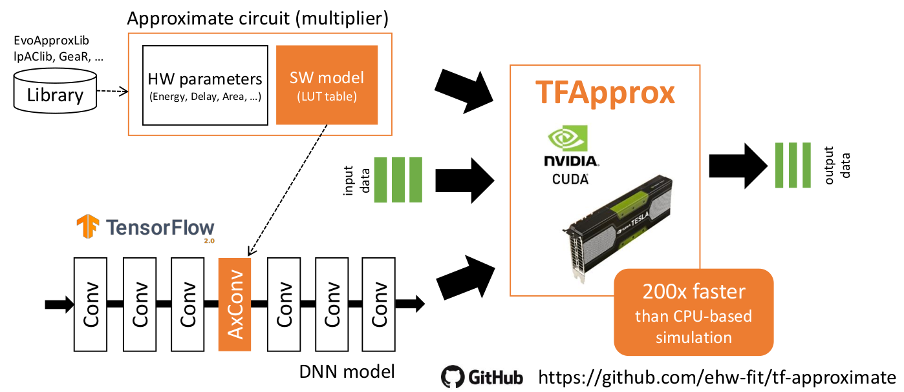

# TensorFlow Approximate Layers for GPUs

## Overview
This library extends TensorFlow library by **ApproxConv2DWithMinMaxVars** layer that implements **Conv2D** with approximate multiplier. The layer is intended to be used together with **FakeQuantWithMinMaxVars** layers (on inputs) to experiment with approximate/quantized convolutions in FP32 CNNs.

Although the TF layer **ApproxConv2DWithMinMaxVars** can be used directly, we also provide Keras wrapper of the layer. The Keras wrapper **FakeApproxConv2D** ([python/keras/layers/fake_approx_convolutional.py](python/keras/layers/fake_approx_convolutional.py)) includes **FakeQuantWithMinMaxVars** to quantize the inputs. Both input and filter ranges (used for quantization) are computed for each batch independently.



## Pre-build singularity container
You can use a [Singularity](https://singularity.lbl.gov/) container (for installation Debian/Ubuntu systems run `sudo apt install singularity-container` command). Note that version 3.0 is needed at least!

As a first step download the container
   
    singularity pull https://ehw.fit.vutbr.cz/tf-approximate/tf-approximate-gpu.sif
    # or wget command can be used
    wget https://ehw.fit.vutbr.cz/tf-approximate/tf-approximate-gpu.sif
    # or just download the file using web browser
    
Then, you can run the container on your machine. We recommend to use *-H* command to override the Python packages you may have installed in your $HOME folder and *--bind* parameter to bind the folder you are working in.


    singularity shell -H $(pwd) --nv --bind . ../../tf-approximate-gpu.sif
    
This command switches you to the container (the command line should start with `Singularity> ` prefix). You can run two short tests

```bash
python -c "import tensorflow as tf; print(tf.__version__)"
# Response: 2.1.0
python /opt/tf-approximate-gpu/test/test_table_approx_conv_2d.py
# Response: Linf Error: 3.072154584060627e-07 (or different negligible number)
```

Your container is prepared, and you can run your own script inside it.


## Example: Approximation of accurate neural network
An example provided in [examples](examples) shows usage of Keras layer **FakeApproxConv2D**, which allows simulating convolution using an approximate 8x8 bit multiplier defined in a binary table.

The first step is to train the network defined using Keras layer (with accurate FP32 operations) as usual and store resulting weights to the file `lenet5_weights`:

```bash
python examples/fake_approx_train.py
```

In the accurate model, the neural network has a following structure
```python
model = tf.keras.Sequential([
    tf.keras.layers.Conv2D(filters=6, kernel_size=(3, 3), activation='relu'),
    tf.keras.layers.AveragePooling2D(),
    tf.keras.layers.Conv2D(filters=16, kernel_size=(3, 3), activation='relu'),
    tf.keras.layers.Flatten(),
    tf.keras.layers.Dense(120, activation='relu'),
    tf.keras.layers.Dense(84, activation='relu'),
    tf.keras.layers.Dense(10, activation='softmax')
])
```

For the approximate version, you can simply replace `Conv2D` operations by the proposed `FakeApproxConv2D` that performs a *fake quantization* and multiplication using operation defined by a binary lookup table in [binary files](examples/axmul_8x8). The included multipliers come from [EvoApprox](https://github.com/ehw-fit/evoapproxlib) library, however arbitrary approximate multipliers may be used.

```python
approx_model = tf.keras.Sequential([
    FakeApproxConv2D(filters=6, kernel_size=(3, 3), activation='relu', mul_map_file=args.mtab_file),
    tf.keras.layers.AveragePooling2D(),
    FakeApproxConv2D(filters=16, kernel_size=(3, 3), activation='relu', mul_map_file=args.mtab_file),
    tf.keras.layers.Flatten(),
    tf.keras.layers.Dense(120, activation='relu'),
    tf.keras.layers.Dense(84, activation='relu'),
    tf.keras.layers.Dense(10, activation='softmax')
])
```
After the construction of the approximate neural network, the weights from the accurate neural network are loaded back 
```python
approx_model.load_weights('lenet5_weights')
```

A script with approximating neural network trained by [examples/fake_approx_train.py](examples/fake_approx_train.py) script is provided in [examples/fake_approx_eval.py](examples/fake_approx_eval.py) with the following usage.

```bash
python examples/fake_approx_eval.py --mtab_file examples/axmul_8x8/mul8u_L40.bin
```
Leaving the argument "mtab_file" (multiplication table file) out will cause **FakeApproxConv2D** layers to use accurate 8x8 bit multiplication.


## Building from source
The library is implemented as dynamically loaded plugin for TensorFlow. The library can be either downloaded as CUDA enabled Singularity container [tf-approximate-gpu.sif](https://ehw.fit.vutbr.cz/tf-approximate/tf-approximate-gpu.sif) based on "tensorflow/tensorflow:latest-gpu-py3" image or built from sources

```bash
mkdir build
cd build
cmake .. -DTFAPPROX_CUDA_ARCHS="75"
make
```

The prerequisites to build the library are working installation of CUDA SDK (10.0+), and TensorFlow (2.1.0+) with GPU (CUDA) support enabled. The build system provides a switch to disable CUDA support, which causes the layer to fallback to **SLOW** CPU implementation: `cmake -DTFAPPROX_ALLOW_GPU_CONV=OFF ..`.  You should set NVCC to compile for your GPU (you can find the CUDA version [in the table](https://developer.nvidia.com/cuda-gpus) or [on Wikipedia](https://en.wikipedia.org/wiki/CUDA#GPUs_supported)). Fat binary for multiple GPU architectures can be generated by specifying a list such as "50;60;75".

Finally built library can be used as
```python
import tensorflow as tf
approx_op_module = tf.load_op_library('libApproxGPUOpsTF.so')
```

## Approximation by your own multiplier
You can follow the examples. The only one thing to change is the production of a new __bin__ file. It can be generated in C/C++ as follows
```c
FILE * f = fopen("output.bin", "wb");

for(unsigned int a = 0; a < 256; a++)
    for(unsigned int b = 0; b < 256; b++) {
      uint16_t val = approximate_mult(a, b); // replace by your own function call
      fwrite(&val, sizeof(uint16_t), 1, f);
    }

fclose(f);
```
while `approximate_mult` is you approximate multiplication code in C. To check the validity of the packing function, you can also check if an accurate multiplier produces exactly the same file as [examples/axmul_8x8/mul8u_1JFF.bin](examples/axmul_8x8/mul8u_1JFF.bin)
